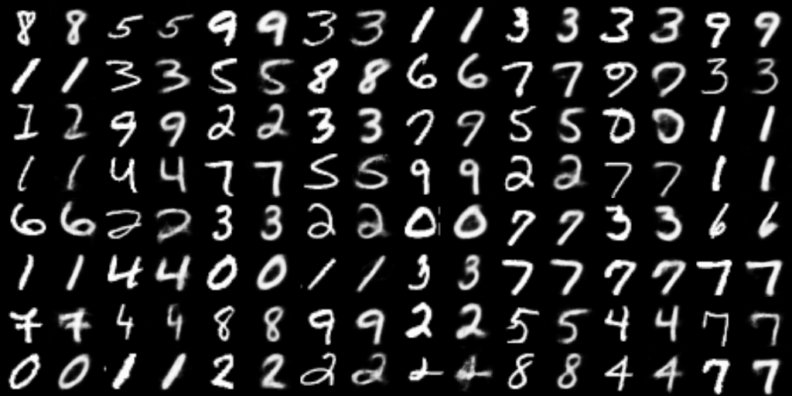
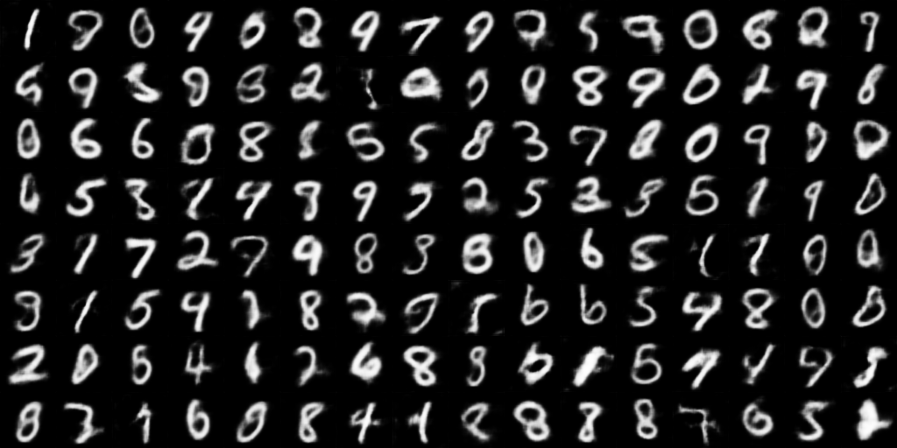

# Convolutional Variational Autoencoder (CVAE) on MNIST

Convolutional variational autoencoder (CVAE) implementation in MLX using
MNIST.[^1]

## Setup 

Install the requirements:

```
pip install -r requirements.txt
```

## Run


To train a VAE run:

```shell
python main.py
```

To see the supported options, do `python main.py -h`.

Training with the default options should give:

```shell
$ python train.py 
Options: 
  Device: GPU
  Seed: 0
  Batch size: 128
  Max number of filters: 64
  Number of epochs: 50
  Learning rate: 0.001
  Number of latent dimensions: 8
Number of trainable params: 0.1493 M
Epoch    1 | Loss   14626.96 | Throughput  1803.44 im/s | Time     34.3 (s)
Epoch    2 | Loss   10462.21 | Throughput  1802.20 im/s | Time     34.3 (s)
...
Epoch   50 | Loss    8293.13 | Throughput  1804.91 im/s | Time     34.2 (s)
```

The throughput was measured on a 32GB M1 Max. 

Reconstructed and generated images will be saved after each epoch in the
`models/` path. Below are examples of reconstructed training set images and
generated images.

#### Reconstruction



#### Generation 




## Limitations

At the time of writing, MLX does not have transposed 2D convolutions. The
example approximates them with a combination of nearest neighbor upsampling and
regular convolutions, similar to the original U-Net. We intend to update this
example once transposed 2D convolutions are available.

[^1]: For a good overview of VAEs see the original paper [Auto-Encoding
  Variational Bayes](https://arxiv.org/abs/1312.6114) or [An Introduction to
  Variational Autoencoders](https://arxiv.org/abs/1906.02691).
