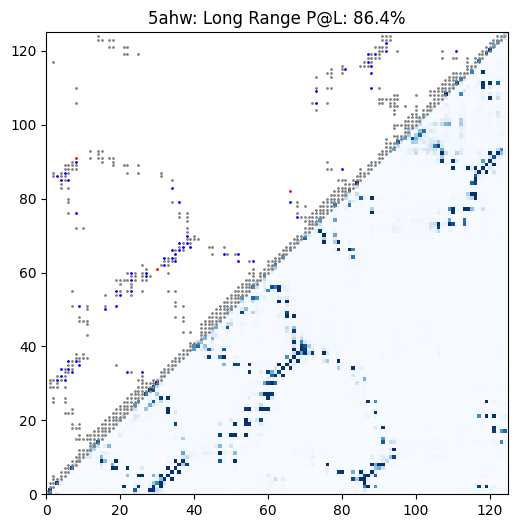

# ESM-2

This repository provides an implementation of Meta's ESM-2 protein language model
in MLX.[^1] ESM-2 is Meta’s second-generation Evolutionary Scale Model, a
transformer-based protein language model trained on millions of diverse protein
sequences with a masked language modeling objective.



_Example contact prediction map for a universal stress protein. In this case, ESM-2 650M achieves 86.4% precision at long-range contacts._

## Setup

Install the requirements:

```bash
pip install -r requirements.txt
```

## Usage

Below are the available ESM-2 models:
| Model | Parameters | Layers |
|-------|------------|--------|
| [`esm2_t6_8M_UR50D`](https://huggingface.co/facebook/esm2_t6_8M_UR50D) | 8M | 6 |
| [`esm2_t12_35M_UR50D`](https://huggingface.co/facebook/esm2_t12_35M_UR50D) | 35M | 12 |
| [`esm2_t30_150M_UR50D`](https://huggingface.co/facebook/esm2_t30_150M_UR50D) | 150M | 30 |
| [`esm2_t33_650M_UR50D`](https://huggingface.co/facebook/esm2_t33_650M_UR50D) | 650M | 33 |
| [`esm2_t36_3B_UR50D`](https://huggingface.co/facebook/esm2_t36_3B_UR50D) | 3B | 36 |
| [`esm2_t48_15B_UR50D`](https://huggingface.co/facebook/esm2_t48_15B_UR50D) | 15B | 48 |

Convert a model to MLX format:

```bash
python convert.py --hf-path facebook/esm2_t33_650M_UR50D
```

This will save the converted model in a checkpoints directory.

### Basic Inference

```python
from esm import ESM2

# Load model and tokenizer
tokenizer, model = ESM2.from_pretrained("checkpoints/mlx-esm2_t33_650M_UR50D")

# Example protein sequence (human insulin)
sequence = "MALWMRLLPLLALLALWGPDPAAAFVNQHLCGSHLVEALYLVCGERGFFYTPKTRREAEDLQVGQVELGGGPGAGSLQPLALEGSLQKRGIVEQCCTSICSLYQLENYCN"

# Tokenize and run inference
tokens = tokenizer.encode(sequence)
result = model(tokens)
logits = result["logits"]  # Shape: (batch, length, vocab_size)
```

### Masked Language Modeling

```bash
# For a complete example, see main.py
python main.py --sequence "YOUR_SEQUENCE" --mask-position 50
```

### Embeddings

```python
# Get sequence-level representations
seq_repr = model.get_sequence_representations(tokens, layer=-1)  # Shape: (batch, embed_dim)

# Extract per-residue representations from specific layers
representations = model.extract_features(tokens, repr_layers=[20, 30, 33])
final_layer = representations[33]  # Shape: (batch, length, embed_dim)
```

### Contact Prediction

```python
# Predict residue-residue contacts
contacts = model.predict_contacts(tokens)  # Shape: (batch, length, length)

# Or compute contacts together with logits, representations, etc.
outputs = model(tokens, return_contacts=True)
contacts = outputs["contacts"]
```

### Examples

**Mutation Effect Prediction**: [notebooks/mutation_effect_prediction.ipynb](notebooks/mutation_effect_prediction.ipynb)

This notebook demonstrates how to use ESM-2 for zero-shot mutation effect prediction by scoring amino acid substitutions based on their likelihood under the model. We validate the approach using experimental fitness data from β-lactamase TEM, showing how ESM-2 captures functional constraints without requiring structural information.

**Embeddings**: [notebooks/embeddings.ipynb](notebooks/embeddings.ipynb)

This notebook explores how ESM-2 generates meaningful protein embeddings that capture evolutionary and functional relationships between proteins. We analyze six diverse human proteins to demonstrate how the learned representations cluster proteins by function and reveal biological similarities.

**Contact Prediction**: [notebooks/contact_prediction.ipynb](notebooks/contact_prediction.ipynb)

This notebook shows how to predict residue-residue contacts in protein structures using ESM-2's attention patterns. We evaluate contact prediction performance on three diverse proteins, demonstrating how the model captures both local and long-range structural relationships directly from sequence data.

### Benchmarking

Benchmark MLX performance:

```bash
python benchmarks/benchmark_mx.py
```

Benchmark PyTorch MPS performance:

```bash
python benchmarks/benchmark_pt.py
```

Expected performance on M4 MacBook Pro (ESM-2 650M, batch_size = 5):

- MLX: 299 ms per step, 16.71 sequences/sec
- PyTorch MPS: 402 ms per step, 12.43 sequences/sec

### Testing

Verify correctness against original implementation:

```bash
python test.py
```

This tests tokenizer and model outputs (logits, hidden states, and attentions) for equivalence with the original implementation.

### Citations:

```bibtex
@article{rives2019biological,
  author={Rives, Alexander and Meier, Joshua and Sercu, Tom and Goyal, Siddharth and Lin, Zeming and Liu, Jason and Guo, Demi and Ott, Myle and Zitnick, C. Lawrence and Ma, Jerry and Fergus, Rob},
  title={Biological Structure and Function Emerge from Scaling Unsupervised Learning to 250 Million Protein Sequences},
  year={2019},
  doi={10.1101/622803},
  url={https://www.biorxiv.org/content/10.1101/622803v4},
  journal={PNAS}
}

```

```bibtex
@article{Lin2023,
  author={Zeming Lin et al.},
  title={Evolutionary-scale prediction of atomic-level protein structure with a language model},
  journal={Science},
  volume={379},
  pages={1123--1130},
  year={2023},
  doi={10.1126/science.ade2574},
  url={https://doi.org/10.1126/science.ade2574}
}
```

[^1]: Refer to the [paper](https://www.science.org/doi/10.1126/science.ade2574) and [code](https://github.com/facebookresearch/esm) for more details.
