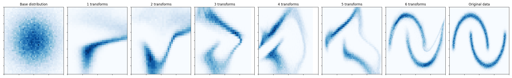

# Normalizing flow

Real NVP normalizing flow for density estimation and sampling from [Dinh et al. (2016)](https://arxiv.org/abs/1605.08803), implemented using `mlx`. 

The example is written in a somewhat more object-oriented style than strictly necessary, with an eye towards extension to other use cases that could from arbitrary distributions and bijectors.

## Basic usage

```py
import mlx.core as mx
from flows import RealNVP

model = RealNVP(n_transforms=8, d_params=4, d_hidden=256, n_layers=4)

x = mx.random.normal(shape=(32, 4))

# Evaluate log-density
model.log_prob(x=x)

# Draw samples
model.sample(sample_shape=(32, 4))
```

## Running the example

Install the dependencies:

```
pip install -r requirements.txt
```

The example can be run with:
```
python main.py
```
which trains the normalizing flow on the two moons dataset and plots the result in `samples.png`. 

By default the example runs on the GPU. To run on the CPU, do:
```
python main.py --cpu
```

For all available options, run:
```
python main.py --help
```

## Results


