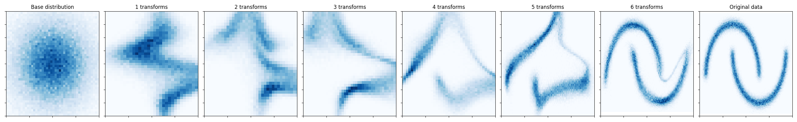

# Normalizing Flow

Real NVP normalizing flow for density estimation and sampling implemented in
MLX.[^1] 

The example is written in a somewhat more object-oriented style than strictly
necessary, with an eye towards extension to other use cases that could
potentially benefit from the use of distributions and bijectors.

## Basic usage

```python
import mlx.core as mx
from flows import RealNVP

model = RealNVP(n_transforms=8, d_params=4, d_hidden=256, n_layers=4)

x = mx.random.normal(shape=(32, 4))

# Evaluate log-density
log_prob = model.log_prob(x=x)

# Draw samples
x_samples = model.sample(sample_shape=(32, 4))
```

## Running the example

Install the dependencies:

```
pip install -r requirements.txt
```

The example can be run with:
```
python main.py [--cpu]
```

which trains the normalizing flow on the two moons dataset and plots the result
in `samples.png`. The optional `--cpu` flag can be used to run the example on
the CPU, otherwise it will use the GPU by default.

For all available options, run:

```
python main.py --help
```

## Results



[^1]: This example is from [Density estimation using Real NVP](
  https://arxiv.org/abs/1605.08803), Dinh et al. (2016)
