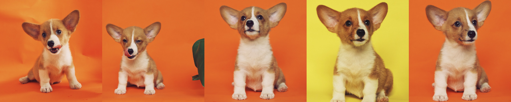
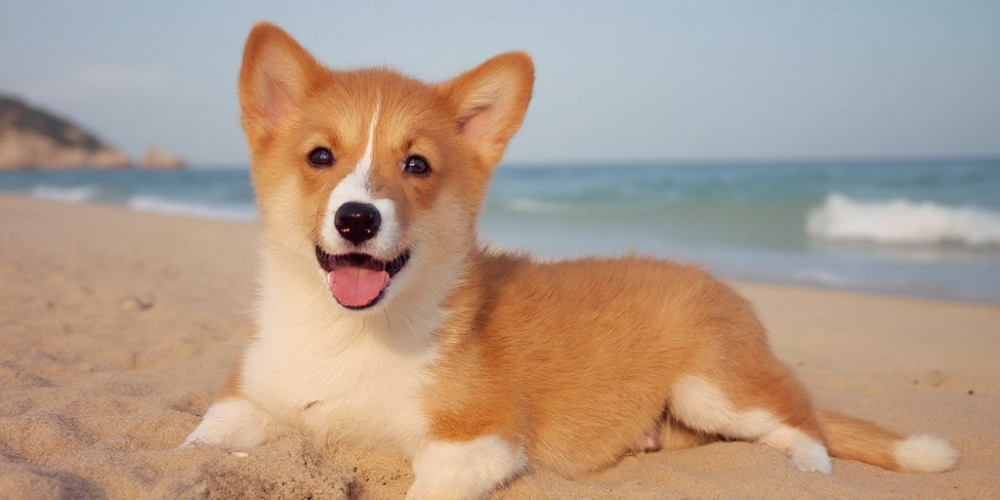

FLUX
====

FLUX implementation in MLX. The implementation is ported directly from
[https://github.com/black-forest-labs/flux](https://github.com/black-forest-labs/flux)
and the model weights are downloaded directly from the Hugging Face Hub.

The goal of this example is to be clean, educational and to allow for
experimentation with finetuning FLUX models as well as adding extra
functionality such as in-/outpainting, guidance with custom losses etc.

    
*Image generated using FLUX-dev in MLX and the prompt 'An image in the style of
tron emanating futuristic technology with the word "MLX" in the center with
capital red letters.'*

Installation
------------

The dependencies are minimal, namely:

- `huggingface-hub` to download the checkpoints.
- `regex` for the tokenization
- `tqdm`, `PIL`, and `numpy` for the scripts
- `sentencepiece` for the T5 tokenizer
- `datasets` for using an HF dataset directly

You can install all of the above with the `requirements.txt` as follows:

    pip install -r requirements.txt


Usage
---------

You can use the following command to generate an image, using `--output` to specify the storage location of the image, defaulting to `out.png`.

```shell
python txt2image.py --model schnell \
    --n-images 1 \
    --image-size 256x512 \
    --verbose \
    'A photo of an astronaut riding a horse on Mars.'
```

For more parameters, please use the `--help` command to view.

```shell
python txt2image.py --help
```

Inference
---------

Inference in this example is similar to the stable diffusion example. The
classes to get you started are `FluxPipeline` from the `flux` module.

```python
import mlx.core as mx
from flux import FluxPipeline

# This will download all the weights from HF hub
flux = FluxPipeline("flux-schnell")

# Make a generator that returns the latent variables from the reverse diffusion
# process
latent_generator = flux.generate_latents(
    "A photo of an astronaut riding a horse on Mars",
    num_steps=4,
    latent_size=(32, 64),  # 256x512 image
)

# The first return value of the generator contains the conditioning and the
# random noise at the beginning of the diffusion process.
conditioning = next(latent_generator)
(
    x_T,                # The initial noise
    x_positions,        # The integer positions used for image positional encoding
    t5_conditioning,    # The T5 features from the text prompt
    t5_positions,       # Integer positions for text (normally all 0s)
    clip_conditioning,  # The clip text features from the text prompt
) = conditioning

# Returning the conditioning as the first output from the generator allows us
# to unload T5 and clip before running the diffusion transformer.
mx.eval(conditioning)

# Evaluate each diffusion step
for x_t in latent_generator:
    mx.eval(x_t)

# Note that we need to pass the latent size because it is collapsed and
# patchified in x_t and we need to unwrap it.
img = flux.decode(x_t, latent_size=(32, 64))
```

The above are essentially the implementation of the `txt2image.py` script
except for some additional logic to quantize and/or load trained adapters. One
can use the script as follows:

```shell
python txt2image.py \
    --n-images 4 \
    --n-rows 2 \
    --image-size 256x512 \
    'A photo of an astronaut riding a horse on Mars.'
```

### Experimental Options

FLUX pads the prompt to a specific size of 512 tokens for the dev model and
256 for the schnell model. Not applying padding results in faster generation
but it is not clear how it may affect the generated images. To enable that
option in this example pass `--no-t5-padding` to the `txt2image.py` script or
instantiate the pipeline with `FluxPipeline("flux-schnell", t5_padding=False)`.

Finetuning
----------

The `dreambooth.py` script supports LoRA finetuning of FLUX-dev (and schnell
but ymmv) on a provided image dataset. The dataset folder must have an
`train.jsonl` file with the following format:

```jsonl
{"image": "path-to-image-relative-to-dataset", "prompt": "Prompt to use with this image"}
{"image": "path-to-image-relative-to-dataset", "prompt": "Prompt to use with this image"}
...
```

The training script by default trains for 600 iterations with a batch size of
1, gradient accumulation of 4 and LoRA rank of 8. Run `python dreambooth.py
--help` for the list of hyperparameters you can tune.

> [!Note]
> FLUX finetuning requires approximately 50GB of RAM. QLoRA is coming soon and
> should reduce this number significantly.

### Training Example

This is a step-by-step finetuning example. We will be using the data from
[https://github.com/google/dreambooth](https://github.com/google/dreambooth).
In particular, we will use `dog6` which is a popular example for showcasing
dreambooth [^1].

The training images are the following 5 images [^2]:



We start by making the following `train.jsonl` file and placing it in the same
folder as the images.

```jsonl
{"image": "00.jpg", "prompt": "A photo of sks dog"}
{"image": "01.jpg", "prompt": "A photo of sks dog"}
{"image": "02.jpg", "prompt": "A photo of sks dog"}
{"image": "03.jpg", "prompt": "A photo of sks dog"}
{"image": "04.jpg", "prompt": "A photo of sks dog"}
```

Subsequently we finetune FLUX using the following command:

```shell
python dreambooth.py \
    --progress-prompt 'A photo of an sks dog lying on the sand at a beach in Greece' \
    --progress-every 600 --iterations 1200 --learning-rate 0.0001 \
    --lora-rank 4 --grad-accumulate 8 \
    path/to/dreambooth/dataset/dog6
```

Or you can directly use the pre-processed Hugging Face dataset
[mlx-community/dreambooth-dog6](https://huggingface.co/datasets/mlx-community/dreambooth-dog6)
for fine-tuning.

```shell
python dreambooth.py \
    --progress-prompt 'A photo of an sks dog lying on the sand at a beach in Greece' \
    --progress-every 600 --iterations 1200 --learning-rate 0.0001 \
    --lora-rank 4 --grad-accumulate 8 \
    mlx-community/dreambooth-dog6
```

The training requires approximately 50GB of RAM and on an M2 Ultra it takes a
bit more than 1 hour.

### Using the Adapter

The adapters are saved in `mlx_output` and can be used directly by the
`txt2image.py` script. For instance,

```shell
python txt2image.py --model dev --save-raw --image-size 512x512 --n-images 1 \
    --adapter mlx_output/final_adapters.safetensors \
    --fuse-adapter \
    --no-t5-padding \
    'A photo of an sks dog lying on the sand at a beach in Greece'
```

generates an image that looks like the following,


and of course we can pass `--image-size 512x1024` to get larger images with
different aspect ratios,



The arguments that are relevant to the adapters are of course `--adapter` and
`--fuse-adapter`. The first defines the path to an adapter to apply to the
model and the second fuses the adapter back into the model to get a bit more
speed during generation.

[^1]: Refer to the [arXiv paper](https://arxiv.org/abs/2208.12242) for more details.
[^2]: The images are from unsplash by https://unsplash.com/@alvannee .


Distributed Computation
------------------------

The FLUX example supports distributed computation during both generation and
training. See the [distributed communication
documentation](https://ml-explore.github.io/mlx/build/html/usage/distributed.html)
for information on how to set-up MLX for distributed communication. The rest of
this section assumes you can launch distributed MLX programs using `mlx.launch
--hostfile hostfile.json`.

### Distributed Finetuning

Distributed finetuning scales very well with FLUX and all one has to do is
adjust the gradient accumulation and training iterations so that the batch
size remains the same. For instance, to replicate the following training

```shell
python dreambooth.py \
    --progress-prompt 'A photo of an sks dog lying on the sand at a beach in Greece' \
    --progress-every 600 --iterations 1200 --learning-rate 0.0001 \
    --lora-rank 4 --grad-accumulate 8 \
    mlx-community/dreambooth-dog6
```

On 4 machines we simply run

```shell
mlx.launch --verbose --hostfile hostfile.json -- python dreambooth.py \
    --progress-prompt 'A photo of an sks dog lying on the sand at a beach in Greece' \
    --progress-every 150 --iterations 300 --learning-rate 0.0001 \
    --lora-rank 4 --grad-accumulate 2 \
    mlx-community/dreambooth-dog6
```

Note the iterations that changed to 300 from 1200 and the gradient accumulations to 2 from 8.

### Distributed Inference

Distributed inference can be divided in two different approaches. The first
approach is the data-parallel approach, where each node generates its own
images and shares them at the end. The second approach is the model-parallel
approach where the model is shared across the nodes and they collaboratively
generate the images.

The `txt2image.py` script will attempt to choose the best approach depending on
how many images are being generated across the nodes. The model-parallel
approach can be forced by passing the argument `--force-shard`.

For better performance in the model-parallel approach we suggest that you use a
[thunderbolt
ring](https://ml-explore.github.io/mlx/build/html/usage/distributed.html#getting-started-with-ring).

All you have to do once again is use `mlx.launch` as follows

```shell
mlx.launch --verbose --hostfile hostfile.json -- \
    python txt2image.py --model schnell \
    --n-images 8 \
    --image-size 512x512 \
    --verbose \
    'A photo of an astronaut riding a horse on Mars'
```

for model-parallel generation you may want to also pass `--env
MLX_METAL_FAST_SYNCH=1` to `mlx.launch` which is an experimental setting that
reduces the CPU/GPU synchronization overhead.
