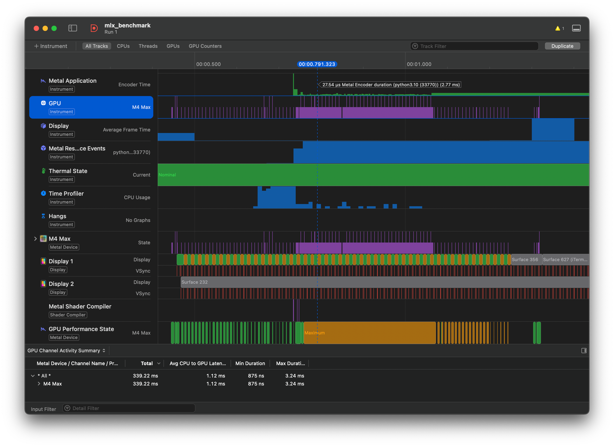
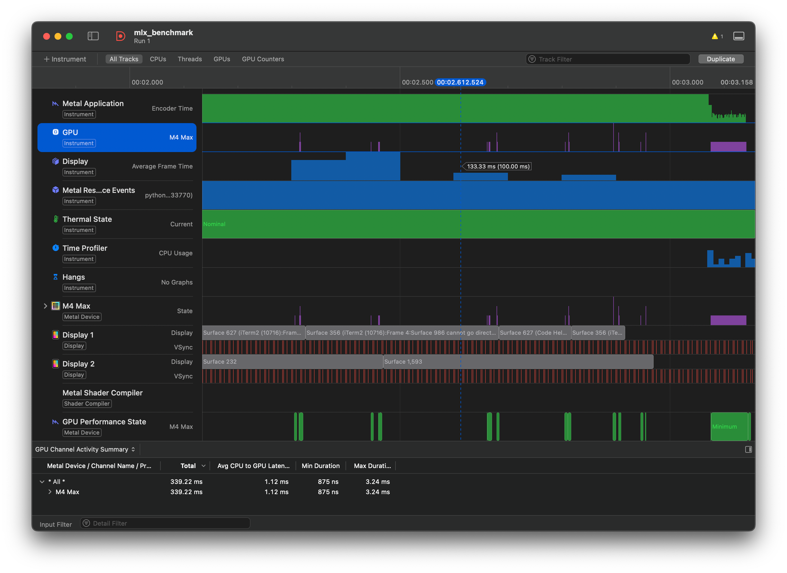

# Profiling MLX with Xcode Instruments

As an engineer working with Apple Silicon, one of the most powerful tools at your disposal is **Xcode Instruments**. While `time.time()` tells you *how long* something takes, Instruments tells you *why*.

This guide will show you how to visualize the "physics" of your MLX model—specifically, seeing the difference between eager execution and compiled kernels (kernel fusion) on the GPU timeline.

## Prerequisites

Make sure you have MLX installed:

```bash
pip install mlx
```

You'll also need Xcode Command Line Tools installed (for `xctrace`):

```bash
xcode-select --install
```

## Why Profile?

On Unified Memory architectures (M-series chips), compute isn't always the bottleneck. Often, it's memory bandwidth or CPU dispatch overhead.

By profiling with the **Metal System Trace**, you can answer:

1. **Is my model GPU-bound or CPU-bound?** (Are there gaps in the GPU timeline?)
2. **Are my kernels fusing correctly?** (Is `mx.compile` working as expected?)
3. **How efficient is the memory usage?**

## The Experiment: "The Gap" vs. "The Block"

We'll use a chain of element-wise operations to demonstrate kernel fusion. This is the clearest way to see the difference between eager and compiled execution.

### 1. Prepare the Benchmark Script

We've provided a benchmark script [`profile_fusion.py`](profile_fusion.py) that performs a chain of element-wise operations:

- **Eager execution**: Each operation (`sin`, `cos`, `exp`, `log`) reads from memory, computes, and writes back—creating gaps in the GPU timeline
- **Compiled execution**: `mx.compile()` fuses all operations into a single kernel, keeping data in GPU registers/cache

Run the script to see the performance difference:

```bash
python guides/profile_fusion.py
```

You should see significant speedup:

```
Warming up...
Running Eager Mode (Capture this!)...
Eager Time: 0.2341s
Running Compiled Mode (Capture this!)...
Compiled Time: 0.0512s
Speedup: 4.57x
```

### 2. Capture the Trace

You can capture the trace using either the **Command Line Interface (Recommended)** or the GUI.

#### Option A: Using `xctrace` (CLI - Recommended)

The CLI method is preferred for reproducibility and automation.

1. **Record the trace:**

   Note that `sudo` is required to attach to system processes for Metal tracing.

   ```bash
   sudo xctrace record --template 'Metal System Trace' \
       --output mlx_benchmark.trace \
       --launch -- \
       $(which python) guides/profile_fusion.py
   ```

2. **Fix permissions (Important):**

   Since the trace was created with `sudo`, it will be owned by root. Change the ownership to your user to open it easily.

   ```bash
   sudo chown -R $(whoami):staff mlx_benchmark.trace
   ```

3. **Open the trace:**

   ```bash
   open mlx_benchmark.trace
   ```

#### Option B: Using Instruments GUI

1. Open **Xcode** → **Open Developer Tool** → **Instruments**.
2. Select the **Metal System Trace** template.
3. In the top-left target menu, choose your active Python environment (or run the script manually and attach to process).
4. Hit **Record** (🔴) and run the script.

---

## Analyzing the Results

Once the trace finishes, look at the **Metal Application** → **GPU** track.

### The "Zoom In" Revelation

At first glance, the **Eager Execution** block might look "full" and busy, while the **Compiled** one looks sparse. **Don't be fooled!**

**Key Insight:** The "empty space" in the Compiled trace isn't wasted time—it's **saved time**. The GPU finished the work so quickly that it's waiting for the next command.

### Case 1: Eager Execution (Memory Bound)

Without compilation, MLX dispatches kernels one by one (`sin` → `cos` → `exp` → `log`).



- **What you see:** Thousands of tiny kernel launches packed together. Each bar is a separate kernel launch.
- **The bottleneck:** Each operation reads from memory, computes, and writes back. The overhead of memory traffic and kernel launch dominates execution time.

### Case 2: Compiled Execution (Kernel Fusion)

With `mx.compile()`, MLX fuses the chain of operations into a single GPU kernel.



- **What you see:** A few large, dense blocks of GPU activity with gaps in between.
- **The optimization:** Data stays in GPU registers/cache throughout the fused operation. No intermediate memory traffic. The GPU executes the entire chain in one pass.

---

## Understanding the Performance Difference

The performance gap between eager and compiled execution comes from:

1. **Kernel Launch Overhead**: Each kernel launch has a fixed cost. Eager mode pays this cost for every operation.
2. **Memory Traffic**: Eager mode writes intermediate results to memory and reads them back. Compiled mode keeps data in registers/cache.
3. **Metal Command Buffer Efficiency**: Fused kernels submit fewer command buffers to the GPU.

On a typical M-series chip, you might see results like:

- **Eager**: ~230ms for the element-wise fusion benchmark
- **Compiled**: ~50ms for the same work

The exact numbers depend on your chip (M1/M2/M3/M4), memory bandwidth, and thermal state.

---

## Tips for Effective Profiling

1. **Always warm up**: JIT compilation happens on first run. Profile the second or third iteration.
2. **Look for patterns**: Regular gaps indicate batch processing opportunities. Irregular gaps suggest CPU bottlenecks.
3. **Check memory pressure**: The "Memory" track shows if you're swapping or hitting bandwidth limits.
4. **Compare with baselines**: Profile the same model before and after optimization to verify improvements.

---

## Common Pitfalls

- **Don't profile the first run**: Compilation overhead will dominate.
- **Watch for lazy evaluation**: Always call `mx.eval()` to force computation at the right time.
- **Thermal throttling**: Long profiles can trigger thermal throttling. Keep benchmarks short and representative.

---

## Summary

Optimization on Apple Silicon is about minimizing data movement. By using Instruments, you can verify if `mx.compile` is actually doing its job. If you see gaps, verify your compilation logic or check if you are falling back to CPU operations unexpectedly.

This technique works for any MLX model—transformers, convnets, diffusion models, etc. The key is to identify the hot path in your code and verify that Metal is executing it efficiently.
