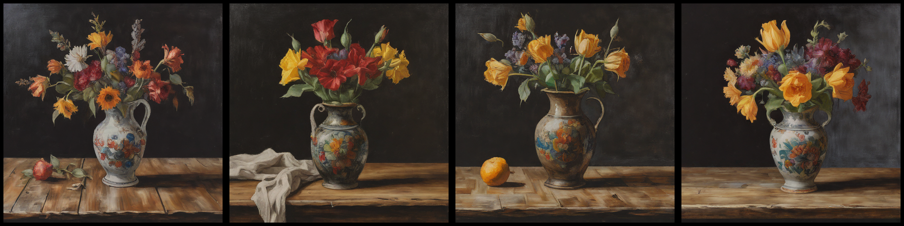

Stable Diffusion
================

Stable Diffusion in MLX. The implementation was ported from Hugging Face's
[diffusers](https://huggingface.co/docs/diffusers/index) and model weights are
downloaded directly from the Hugging Face hub. The implementation currently
supports the following models:

- [stabilityai/sdxl-turbo](https://huggingface.co/stabilityai/sdxl-turbo)
- [stabilitiai/stable-diffusion-2-1](https://huggingface.co/stabilityai/stable-diffusion-2-1)

    
*Image generated using Stable Diffusion in MLX and the prompt 'A big red sign
saying MLX in capital letters.'*

Installation
------------

The dependencies are minimal, namely:

- `huggingface-hub` to download the checkpoints.
- `regex` for the tokenization
- `tqdm`, `PIL`, and `numpy` for the `txt2image.py` script

You can install all of the above with the `requirements.txt` as follows:

    pip install -r requirements.txt

Usage
------

Although each component in this repository can be used by itself, the fastest
way to get started is by using the `StableDiffusion` class from the `stable_diffusion`
module.

```python
import mlx.core as mx
from stable_diffusion import StableDiffusion

# This will download all the weights from HF hub and load the models in
# memory
sd = StableDiffusion()

# This creates a python generator that returns the latent produced by the
# reverse diffusion process.
#
# Because MLX is lazily evaluated iterating over this generator doesn't
# actually perform the computation until mx.eval() is called.
latent_generator = sd.generate_latents(
    "A photo of an astronaut riding a horse on Mars."
)

# Here we are evaluating each diffusion step but we could also evaluate
# once at the end.
for x_t in latent_generator:
    mx.eval(x_t)

# Now x_t is the last latent from the reverse process aka x_0. We can
# decode it into an image using the stable diffusion VAE.
im = sd.decode(x_t)
```

The above is essentially the implementation of the `txt2image.py` script in the
root of the repository. You can use the script as follows:


```shell
python txt2image.py "A photo of an astronaut riding a horse on Mars." --n_images 4 --n_rows 2
```

You can select the model using `--model` argument. Currently supported models
are `sdxl` (default) and `sd`.

Image 2 Image
-------------

There is also the option of generating images based on another image using the
example script `image2image.py`. To do that an image is first encoded using the
autoencoder to get its latent representation and then noise is added according
to the forward diffusion process and the `strength` parameter. A `strength` of
0.0 means no noise and a `strength` of 1.0 means starting from completely
random noise.

    

*Generations with varying strength using the original image and the prompt 'A lit fireplace'.*

The command to generate the above images is:

```shell
python image2image.py --strength 0.5 original.png 'A lit fireplace'
```

> [!Note]
> `image2image.py` will automatically downsample your input image to guarantee
> that its dimensions are divisible by 64. If you want full control of this
> process, resize your image prior to using the script.

Memory constrained devices
--------------------------

The `txt2image.py` script by default loads the model in float16 which reduces
significantly the required memory for image generation. However, since the
Stable Diffusion XL UNet alone has 2.6B parameters in order to use it in
devices with 8GB of RAM, quantization is practically necessary.

The `txt2image.py` script supports quantization using the `-q` or `--quantize`
command line arguments. When quantization is used, the script quantizes the
text encoder models to 4 bits and the unet to 8 bits. This allows generating
images on an 8GB Mac Mini with no-swapping.

```
python txt2image.py --n_images 4 -q -v --output still-life.png "A painting of a vase on a wooden table, dark background, still life."
```

    
*Image generated using Stable Diffusion XL turbo in MLX with the above command on an 8GB M1 Mac mini*
