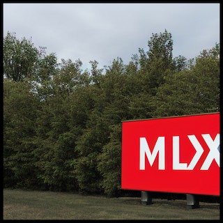
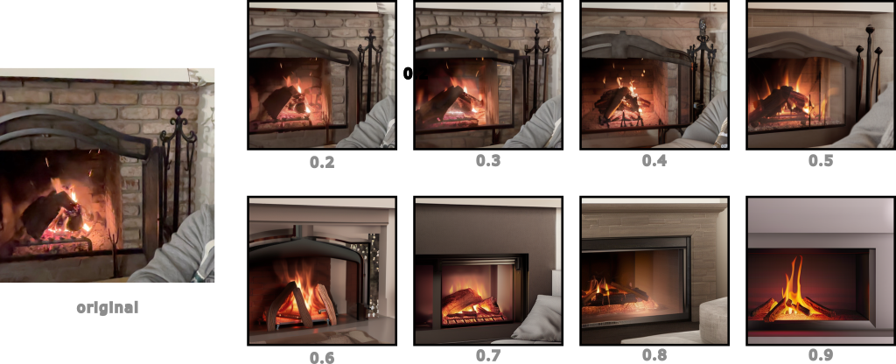

Stable Diffusion
================

Stable Diffusion in MLX. The implementation was ported from Hugging Face's
[diffusers](https://huggingface.co/docs/diffusers/index) and we are fetching
and using the weights available on the Hugging Face Hub by Stability AI at
[stabilitiai/stable-diffusion-2-1](https://huggingface.co/stabilityai/stable-diffusion-2-1).

    
*Image generated using Stable Diffusion in MLX and the prompt 'A big red sign saying MLX in capital letters.'*

Installation
------------

The dependencies are minimal, namely:

- `safetensors` and `huggingface-hub` to load the checkpoints.
- `regex` for the tokenization
- `numpy` because safetensors needs to return some form of array
- `tqdm` and `PIL` for the `txt2image.py` script

You can install all of the above with the `requirements.txt` as follows:

    pip install -r requirements.txt

Usage
------

Although each component in this repository can be used by itself, the fastest
way to get started is by using the `StableDiffusion` class from the `stable_diffusion`
module.

```python
import mlx.core as mx
from stable_diffusion import StableDiffusion

# This will download all the weights from HF hub and load the models in
# memory
sd = StableDiffusion()

# This creates a python generator that returns the latent produced by the
# reverse diffusion process.
#
# Because MLX is lazily evaluated iterating over this generator doesn't
# actually perform the computation until mx.eval() is called.
latent_generator = sd.generate_latents("A photo of an astronaut riding a horse on Mars.")

# Here we are evaluating each diffusion step but we could also evaluate
# once at the end.
for x_t in latent_generator:
    mx.eval(x_t)

# Now x_t is the last latent from the reverse process aka x_0. We can
# decode it into an image using the stable diffusion VAE.
im = sd.decode(x_t)
```

The above is almost line for line the implementation of the `txt2image.py`
script in the root of the repository. You can use the script as follows:

    python txt2image.py "A photo of an astronaut riding a horse on Mars." --n_images 4 --n_rows 2

Image 2 Image
-------------

There is also the option of generating images based on another image using the
example script `image2image.py`. To do that an image is first encoded using the
autoencoder to get its latent representation and then noise is added according
to the forward diffusion process and the `strength` parameter. A `strength` of
0.0 means no noise and a `strength` of 1.0 means starting from completely
random noise.

    
*Generations with varying strength using the original image and the prompt 'A lit fireplace'.*

The command to generate the above images is:

    python image2image.py --strength 0.5 original.png 'A lit fireplace'

*Note: `image2image.py` will automatically downsample your input image to guarantee that its dimensions are divisible by 64. If you want full control of this process, resize your image prior to using the script.*

Performance
-----------

The following table compares the performance of the UNet in stable diffusion.
We report throughput in images per second **processed by the UNet** for the
provided `txt2image.py` script and the `diffusers` library using the MPS
PyTorch backend.

At the time of writing this comparison convolutions are still some of the least
optimized operations in MLX. Despite that, MLX still achieves **~40% higher
throughput** than PyTorch with a batch size of 16 and ~15% higher when
comparing the optimal batch sizes.

Notably, PyTorch achieves almost ~50% higher throughput for the batch size of 1
which is unfortunate as that means that a single image can be computed faster.
However, when starting with the models not loaded in memory and PyTorch's MPS
graph kernels not cached, the compilation time more than accounts for this
speed difference.

| Batch size |   PyTorch   |     MLX     |
| ---------- | ----------- | ----------- |
| 1          |  6.25 im/s  |  4.17 im/s  |
| 2          |  7.14 im/s  |  5.88 im/s  |
| 4          |**7.69 im/s**|  7.14 im/s  |
| 6          |  7.22 im/s  |  8.00 im/s  |
| 8          |  6.89 im/s  |  8.42 im/s  |
| 12         |  6.62 im/s  |  8.51 im/s  |
| 16         |  6.32 im/s  |**8.79 im/s**|

The above experiments were made on an M2 Ultra with PyTorch version 2.1,
diffusers version 0.21.4 and transformers version 4.33.3. For the generation we
used classifier free guidance which means that the above batch sizes result
double the images processed by the UNet.

Note that the above table means that it takes about 90 seconds to fully
generate 16 images with MLX and 50 diffusion steps with classifier free
guidance and about 120 for PyTorch.
